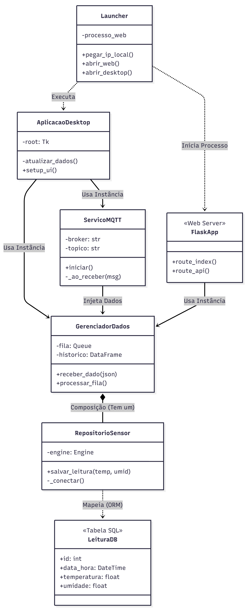

# 🌡️ Sistema de Monitoramento IoT - Arquitetura MVC

> **Desenvolvido por:** Gian
> **Contexto:** Projeto Acadêmico (Certificadora)

Este projeto é um sistema completo de monitoramento ambiental (Temperatura e Umidade) baseado em IoT (Internet das Coisas). Ele captura dados de sensores em tempo real, transmite via protocolo MQTT e oferece visualização multi-plataforma (Desktop e Web), com persistência histórica em banco de dados.

---

## 🚀 Funcionalidades Principais

* **📡 Coleta em Tempo Real:** Leitura de sensores DHT22 via ESP32 (Simulação Wokwi).
* **🔄 Arquitetura Modular:** Separação clara entre Dados (Model), Conexão (Service) e Interfaces (View).
* **💾 Persistência de Dados:** Histórico salvo automaticamente no MariaDB usando ORM (SQLAlchemy).
* **💻 Interface Desktop:** Aplicação nativa Windows usando `Tkinter` e gráficos estáticos com `Matplotlib`.
* **🌍 Interface Web (Mobile):** Dashboard moderno usando `Flask` e gráficos dinâmicos com `Chart.js`, acessível pelo celular na mesma rede Wi-Fi.
* **🛡️ Robustez:** Sistema "Graceful Degradation" (continua funcionando em memória RAM mesmo se o banco de dados cair).

---

## 🛠️ Tecnologias Utilizadas

### Backend & Core
* **Python 3.12+**
* **SQLAlchemy:** ORM para gerenciamento do Banco de Dados.
* **MariaDB Connector:** Driver oficial para conexão com o banco.
* **Paho-MQTT:** Cliente para comunicação com o broker IoT.
* **Pandas:** Manipulação de dados e buffer em memória.

### Frontend
* **Flask:** Servidor Web leve.
* **Chart.js:** Biblioteca JavaScript para gráficos animados.
* **Tkinter:** GUI nativa do Python.
* **Matplotlib:** Plotagem de gráficos científicos (Desktop).

### Hardware / IoT
* **ESP32:** Microcontrolador (Simulado).
* **MicroPython:** Linguagem utilizada no firmware do ESP32.
* **Wokwi:** Plataforma de simulação de eletrônica.

---

## 📂 Estrutura do Projeto

O projeto segue padrões de **Clean Architecture** e **MVC**:

```text
📁 certificadora_2/
│
├── 📄 launcher.py       # Ponto de entrada (Menu Principal com detecção de IP)
├── 📄 config.py         # Configurações sensíveis (Senhas, Hosts, Portas)
│
├── 🧱 Camada de Dados
│   ├── 📄 database.py   # Gerenciamento de conexão SQL (SQLAlchemy)
│   └── 📄 model.py      # Lógica de negócios e gerenciamento de filas
│
├── 📡 Camada de Serviço
│   └── 📄 service.py    # Cliente MQTT (Recebe dados do ESP32)
│
├── 🖥️ Camada de Interface (Views)
│   ├── 📄 desktop_app.py # Aplicação Desktop (Tkinter)
│   ├── 📄 app_flask.py   # Servidor Web (Flask)
│   └── 📁 templates/
│        └── 📄 index.html # Frontend Web (HTML + JS + Chart.js)
```

## ⚙️ Instalação e Configuração
### 1. Pré-requisitos
Certifique-se de ter instalado:

Python 3.x

MariaDB Server

### 2. Instalação das Dependências
No terminal, execute:

```bash
    pip install flask sqlalchemy mariadb pandas paho-mqtt matplotlib
```

### 3. Configuração do Banco de Dados
Abra seu gerenciador SQL (HeidiSQL, Workbench).

O sistema cria a tabela automaticamente, mas certifique-se de que o serviço MariaDB esteja rodando.

Edite o arquivo config.py com suas credenciais:

```bash
DB_USER = "root"
DB_PASS = "" # Sua senha
```

## ▶️ Como Executar

Inicie o Painel de Controle: Execute o arquivo principal na raiz do projeto:

```bash
    python launcher.py
```

Escolha o Modo:

### 🌍 Servidor Flask: Inicia o servidor web e abre o navegador automaticamente. Use o IP exibido para acessar pelo celular.

### 💻 Interface Desktop: Abre a janela nativa do Windows para monitoramento local.

Inicie a Simulação (IoT):

Acesse o projeto no Wokwi.com.

Certifique-se de que o código MicroPython do ESP32 está apontando para o mesmo tópico MQTT (gian/projeto/sensor).

Dê "Play" na simulação.


## 📊 Diagrama de Arquitetura (Fluxo de Dados)

### 🔄 Fluxo da Informação

1.  **📡 Coleta:** O **ESP32** lê o sensor e envia um JSON para a nuvem (Broker).
2.  **📥 Recepção:** O arquivo `service.py` recebe a mensagem e passa para o `model.py`.
3.  **🧠 Processamento:** O `model.py` faz duas coisas ao mesmo tempo:
    * Envia para o **Banco de Dados** (via `database.py`) para histórico eterno.
    * Envia para a **Memória RAM** (Fila) para acesso instantâneo.
4.  **🖥️ Visualização:**
    * O **Flask** pega da memória e manda para a web(localhost).
    * O **Tkinter** pega da memória e mostra na Janela do Windows.
  
```text
CLIENTE 1 (Publicador)                     SERVIDOR (Intermediário)                   CLIENTE 2 (Assinante)
    +-------------------------+                 +--------------------------+               +-------------------------+
    |                         |    Internet     |                          |   Internet    |                         |
    |      ESP32 (Wokwi)      |---------------->|     BROKER MOSQUITTO     |-------------->|   Seu PC (service.py)   |
    |                         |  (Envia msg)    |   (test.mosquitto.org)   | (Recebe msg)  |                         |
    +-------------------------+                 +--------------------------+               +-------------------------+
                 |                                           ^                                          ^
                 |                                           |                                          |
       "A temperatura é 25°C"                     Guarda e Redistribui                       "Ah, chegou 25°C!"
        (Tópico: gian/...)                                                                    (Processa o dado)
```

## ⚙️ Diagrama de classes

